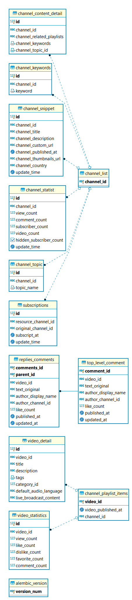

# Use-topic-trend
> Use Api key
### 目標功能
* 使用YT的話題內容的文字雲
    * 採用發燒影片
        * 實際效用 
            1. 可以自訂時間內製作圖表方面查看風向
            2. 製作日/月/季統計聲量變化圖
            3. 如果放上粉專或導入APP可以讓無聊的人迅速了解最新話題，可由TAG直接搜尋相關影片
            4. 比Google Tread更及時
    * 採用該支影片
        * 實際效用
            1. 可讓頻道主方便了解觀眾喜好
            2. 可以設為付費服務掙些學費
            3. 迅速了解該影片的觀眾回饋(如果沒時間看留言的話)
    * 採用爬到的在地頻道
        * 實際效用
            1. 方便大眾了解地方趨勢
            2. 可透過資料特徵變化事前宣導訊息真偽，減少不實消息傳佈
            3. 可以做成 "BOT" 放到長輩群組，結合上兩點應該可以有不少流量(大家都喜歡看懶人包)
* 影片TAG分析    
    * 比較頻道間相似TAG內容
        * 實際效用
            1. 可以觀察在相似主題下同類影片的優勢
            2. 促進良性競爭，增加優質內容
            3. 可得知自身頻道與其他頻道的相似程度
    * 頻道整體TAG分佈
        * 實際效用
            1. 印象中官方沒有做TAG的搜尋的功能(雖然第三方做了可能官方就會加上去就是)
            2. 可以做到更細緻的統計，方便頻道做決策
            3. 第三方可由此方法判斷頻道走向或讓廣告商得知頻道屬性
    * 計算該TAG效益
        * 實際效用
            1. 可直接針對主題進行流量統計
            2. 透過文字雲得知該TAG的內容回饋

# ERD

